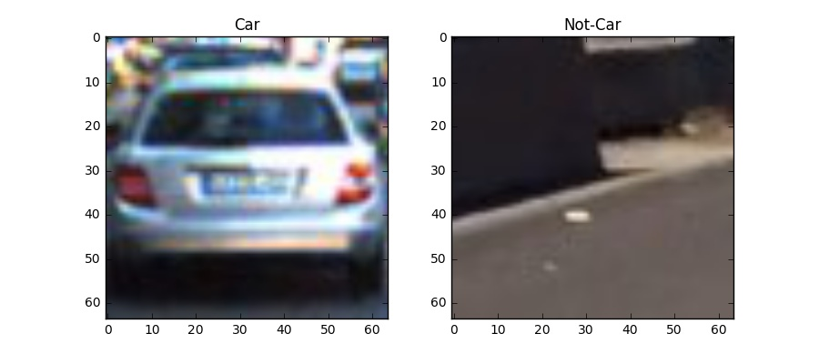
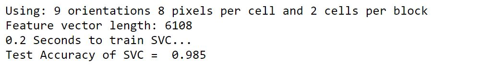
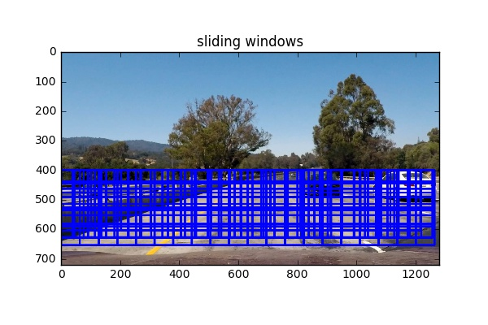

# Vehicle Detection and Tracking
This project is the fifth project of the Udacity Self-Driving Car NanoDegree program.The main goal of the project is to write a  software pipeline to detect the cars in a video from a front-facing camera on a car.

## Contents of this reposity

* 'Vehicle-Detection-and-Tracking.ipynb' Jupyter notebook with code for the project
* `output_images` a directory with processed images
* `output_videos` a directory with processed videos
* `test_images` a directory with test images

## Contents of the program

The goals/steps of this project are the following:
 
* Perform a Histogram of Oriented Gradients (HOG) feature extraction on a labeled training set of images and train a classifier Linear SVM classifier
* Optionally, you can also apply a color transform and append binned color features, as well as histograms of color, to your HOG feature vector.
* Note: for those first two steps don't forget to normalize your features and randomize a selection for training and testing.
* Implement a sliding-window technique and use your trained classifier to search for vehicles in images.
* Run your pipeline on a video stream (start with the test_video.mp4 and later implement on full project_video.mp4) and create a heat map of recurring detections frame by frame to reject outliers and follow detected vehicles.
* Estimate a bounding box for vehicles detected.

Here I'll consider the rubric points individually and desrcibe how I addressed each in my implementation.

## Perform a Histogram of Oriented Gradients (HOG) feature extraction on a labeled training set of images 

I started by reading in all the vehicle and non-vehicle images. Here is an example of one of each of the vehicle and non-vehicle classes:

In this section,I used the scikit-image `hog()` function
to extract Histogram of Oriented Gradient features.The 
paramters include: orientations,pixels_per_cell and cells_per_block.Different color spaces and `hog()` parameters were tried to get the best combined feature vector for the detection task.Here is an example using
YCrCb color space and HOG paramters of `orientations=8`,
`pixels_per_cell=(8,8)` and `cells_per_block=(2,2)`:

## Train a classifier Linear SVM classifier
I trained a linear SVM using sklearn.svm function taking
combined features(hog and color) as input.Here are the  training procedure:

* First,I normalized the features with `StandardScalar()` function  from `sklearn.preprocessing` package.
* Second, I shuffled the data into randomized training and test set using `train_test_split` function.
* Third,I used the linear SVC function `LinearSVC()` to 
train the data with `scv.fit(X_train,y_train)`.
* Finally,I checked the score of the classifier with the test set and then finetune the paramters to find out the best paramters and color spaces.

Here is a snapshort of the training process.

## Implement a sliding-window technique and use your trained classifier to search for vehicles in images.

### 1.Implement a sliding-window search method.

I picked up different scales of search windows over the images.The scales are [0.6,0.8,1.0,1.2,1.4,1.6] of the
original window_size(64,64).Here is an example of sliding 
window.

### 2.Applying the pipeline to test images.
Results showed that YCrCb 3-channel HOG features plus spatially binned color and histograms of color in the feature vector gave the best result.And here are some
example images:

 

## Video Implementation

### Run your pipeline on a video stream (start with the test_video.mp4 and later implement on full project_video.mp4)  
First, I'll show the video result with my pipeline.Here
is the link to my video result. 

### create a heat map of recurring detections frame by frame to reject outliers and follow detected vehicles.
I recorded the positions of positive detections in each frame of the video. From the positive detections I created a heatmap and then thresholded that map to identify vehicle positions. I then used scipy.ndimage.measurements.label() to identify individual blobs in the heatmap. I then assumed each blob corresponded to a vehicle. I constructed bounding boxes to cover the area of each blob detected.

Here's an example result showing the heatmap from a series
of frames of video.The result of `scipy.ndimage.measurements.label()` and the bounding boxes then overlaid on the last frame of video.

Based on the heatmap,I used the `scipy.ndimage.measurements.label()` to find out the position of cars.

And the output looks like this:

### challenge: combine laneline algorithms and vehicle detection alorgithm on the video

## Discussion

### problems 

### 

